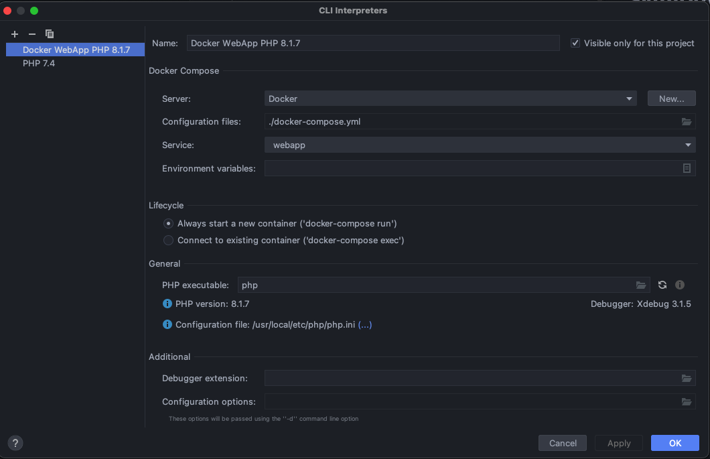
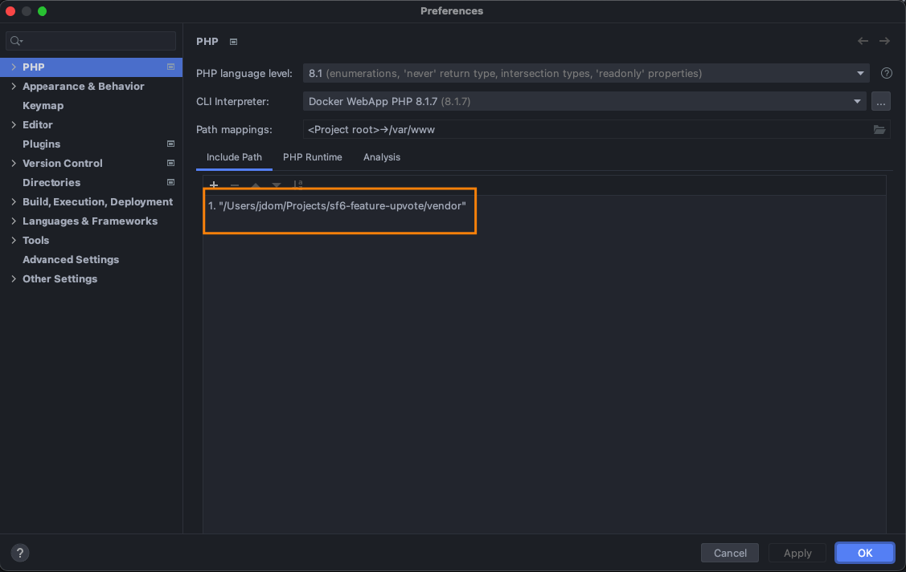
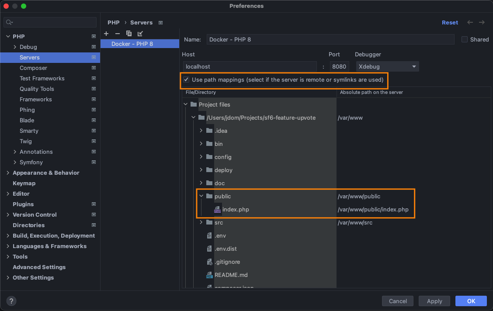

# Symfony 6 Docker Template

## How start

1. Start docker container

```bash
docker-compose up -d
```

2. Install dependencies

```bash
docker exec apache-php bash -c 'composer install' 
```

3. Access to `http://localhost:8080/`

## Docker Utils

```bash
# Access to container "apache-php"
docker-compose exec apache-php sh

# Execute command
docker exec apache-php bash -c 'bin/console cache:clear'

# Build a start container
docker-compose up -d --build apache-php

# Stop containers (but no remove)
docker-compose stop

# Stop containers and remove
docker-compose down
```

## Prepare PHPStorm

### Configure CLI Interpreter

For add a new one, from 

Select: "From Docker, Vagrant, VM, Remote"
Remote: "Docker Compose"
Server: "Docker"
Configuration file: ./docker-compose.yml
Service: "webapp"



### Configure Language Level and Path Mappings

Select your CLI Interpreter defined in the previous step

It is crucial to define the path mapping for the vendor folder:



### Configure remote server (for debug sessions)


